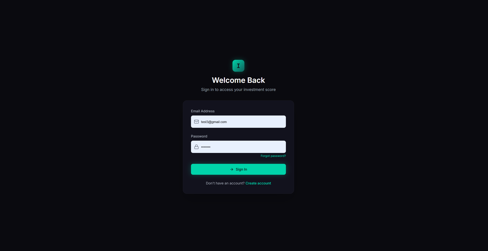
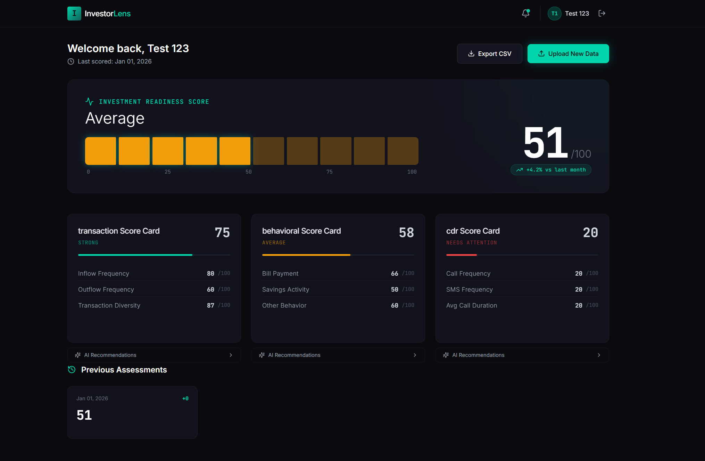
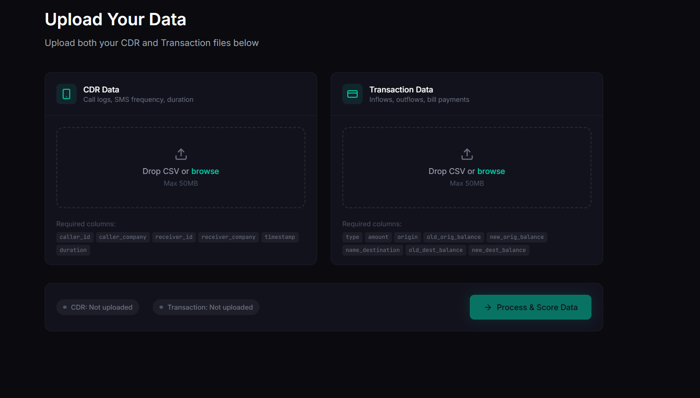
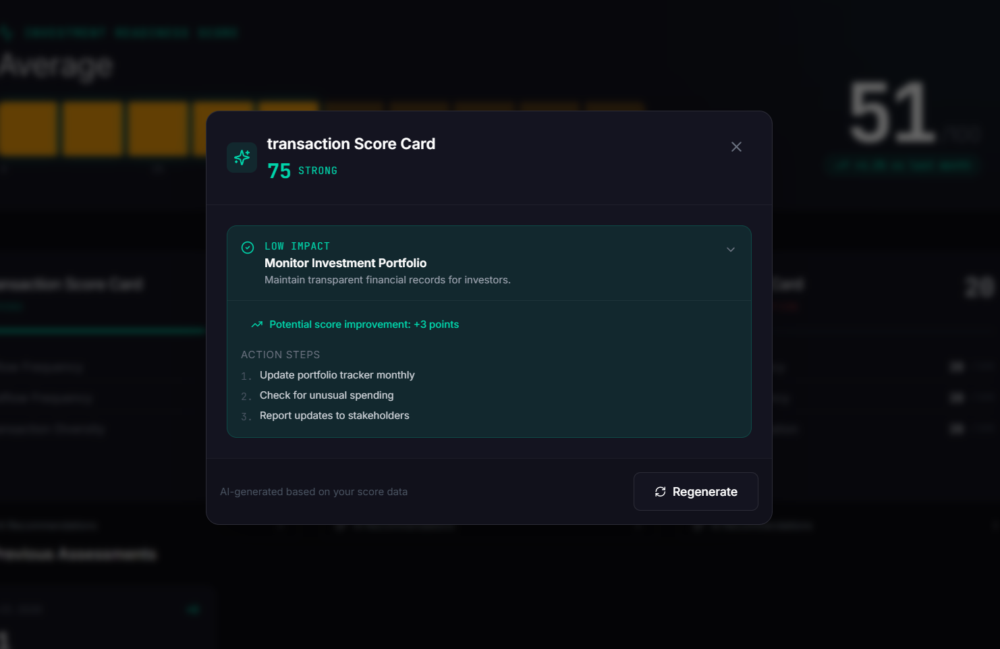

# 📊 Investment Readiness Scoring System (Frontend Demo)

## 📌 Overview
This project is a **frontend demonstration prototype** developed as part of a Master’s dissertation:

**“Design and Evaluation of a Data-Driven Scoring Model for Enhancing Investment Readiness among Low-Income Earners in Emerging Economies.”**

The application demonstrates how users interact with a system that evaluates **investment readiness** using alternative data such as mobile money transactions and behavioural indicators.

---

## 🎯 Purpose
The frontend is designed to:

- Demonstrate the **user interface (UI) and user experience (UX)** of the system
- Visualize **investment readiness scores**
- Provide an interface for **uploading simulated datasets**
- Present **insights and recommendations** based on user behaviour

> ⚠️ This is a **demo prototype** and not a production-ready system.

---

## 🖥️ Screenshots

### 🔐 Login Page


### 📊 Dashboard (With Score)


### 📂 Data Upload Page


### 💡 Recommendation Popup



---

## 🧠 System Concept
The system is based on a **data-driven scoring model** that:

- Uses **simulated mobile money transaction data**
- Incorporates **behavioural analytics**
- Applies **machine learning models** to generate scores

---

## 🖥️ Features

- 📂 **Data Upload**
- 📊 **Dashboard Visualization**
- 📈 **Analytics & Insights**
- 💡 **Recommendations**
- 🔐 **Authentication (Demo)**

---

## 🛠️ Tech Stack

- React.js
- TypeScript / JavaScript
- Tailwind CSS / UI Libraries
- Axios / Fetch API

---

## 📁 Project Structure


---

## 📁 Project Structure
src/
│── components/ # Reusable UI components
│── pages/ # Application pages
│── services/ # API/service layer
│── hooks/ # Custom hooks
│── assets/ # Static files
│── App.tsx # Main entry point


---

## 🚀 Getting Started

### 1. Clone Repository
```bash
git clone <your-repo-link>
cd <project-folder>
```

### 2. Install Dependencies
```bash
npm install
```

### 3. Run Application
```bash
npm start
```

App Runs on:
```bash
http://localhost:3000
```

## 🔗 Backend Integration

This frontend can connect to a backend that:

- Processes uploaded data
- Performs feature engineering
- Runs machine learning models
- Returns investment readiness scores

Mock services may be used if no backend is available.

### 📊 Data Disclaimer
- All data is simulated
- No real user data is used
- Designed to be privacy-preserving
### 🎓 Academic Context

This project is part of a Master’s dissertation at:

**Strathmore University – School of Computing and Engineering Sciences**

### Focus areas:

- Financial Inclusion
- Alternative Data
- Machine Learning in FinTech
### ⚠️ Limitations
- Prototype only
- Uses simulated data
- Not production-ready
### 🔮 Future Work
- Backend integration
- Real-time scoring
- Improved visualizations
- Cloud deployment
### 👤 Author

Newton Kipngeno